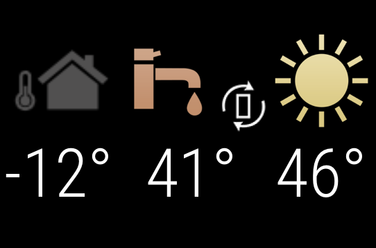

# Module: MMM-AquareaSmartCloud

The `MMM-AquareaSmartCloud` module is a [MagicMirror²](https://github.com/MagicMirrorOrg/MagicMirror) addon. This module displays some of your data from a [https://www.aircon.panasonic.eu/DE_de/aquareaplus/aquarea-smart-cloud/](Panasonic Aquarea Cloud) Adapter on your Mirror.

## Screenshot



## Installing the module

- Run `git clone https://github.com/martinburheimtingstad/MMM-AquareaSmartCloud` from inside your `MagicMirror/modules` folder.
- Then go into the modules direcory: `cd MMM-AquareaSmartCloud`.
- Then run `npm install` to install dependencies.

## Using the module

To use this module, add it to the modules array in the `config/config.js` file:

````javascript
modules: [
		{
			module: 'MMM-AquareaSmartCloud',
			position: 'bottom_right',
			config: {
					email: "user@domain.tld",
					password: "password",
					device_id: "XXXXXXXXXX",
					refreshInterval: 1000 * 60 * 30,
					updateInterval: 1000 * 60 * 30, // optional, default every 10 seconds
			}
		}
]
````

## Configuration options

The following properties can be configured:

<table width="100%">
	<!-- why, markdown... -->
	<thead>
		<tr>
			<th width="25%">Option</th>
			<th width="25%">Description</th>
			<th width="50%">Example values</th>
		</tr>
	<thead>
	<tbody>
		<tr>
			<td><code>email</code></td>
			<td>Your Panasonic Smartcloud email adress<br></td>
			<td>
				<br><b>Example:</b> <code>john.smith@domain.com</code>
				<br> This value is <b>REQUIRED</b>
			</td>
		</tr>
		<tr>
			<td><code>password</code></td>
			<td>Your Panasonic Smartcloud password<br></td>
			<td><br>
				<br><b>Example:</b> <code>password</code>
				<br> This value is <b>REQUIRED</b>
			</td>
		</tr>
		<tr>
			<td><code>device_id</code></td>
			<td>Your heat pump device ID. If not supplied we will show the first device</td>
			<td><br>
				<br><b>Example:</b> <code>79001434541304300000084453731303933831007B1313831373030343453731534369770210000</code>
			</td>
		</tr>
		<tr>
			<td><code>refreshInterval</code></td>
			<td>How often data is fetched from Panasonic (ms)<br>
			<td><br>
				<br><b>Example:</b> <code>1800000</code>
				<br><b>Default value:</b> <code>1800000</code>
				<br> This value is <b>OPTIONAL</b>
			</td>
		</tr>
		<tr>
			<td><code>updateInterval</code></td>
			<td>How often the UI is updated (ms)</td>
			<td><br>
				<br><b>Example:</b> <code>1800000</code>
				<br><b>Default value:</b> <code>1800000</code>
				<br> This value is <b>OPTIONAL</b>
			</td>
		</tr>
	</tbody>
</table>
